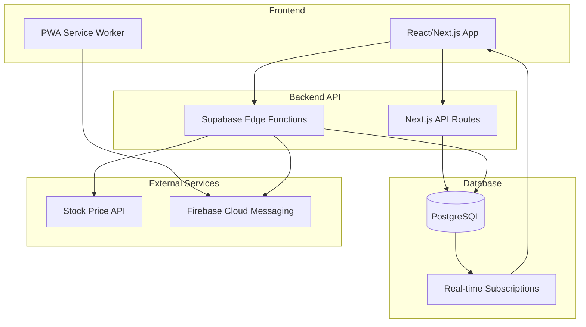
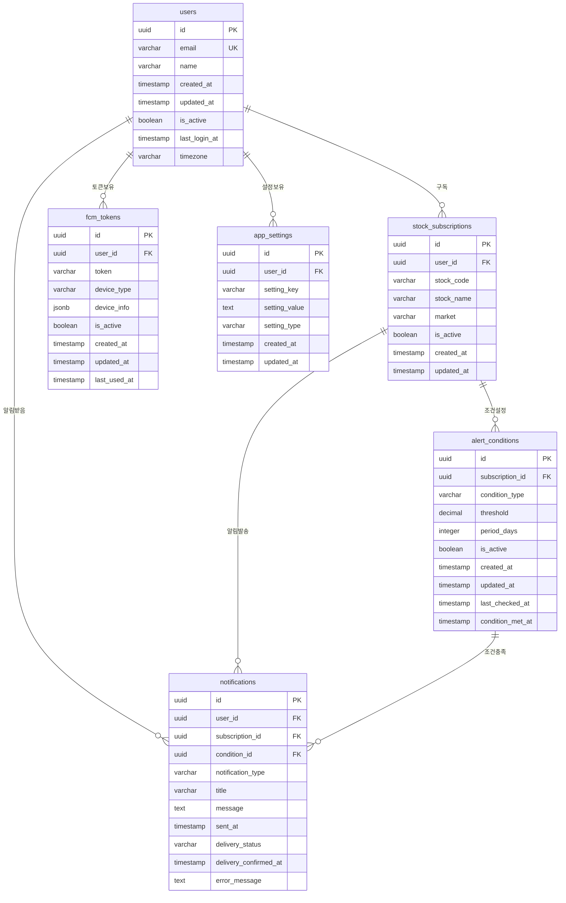
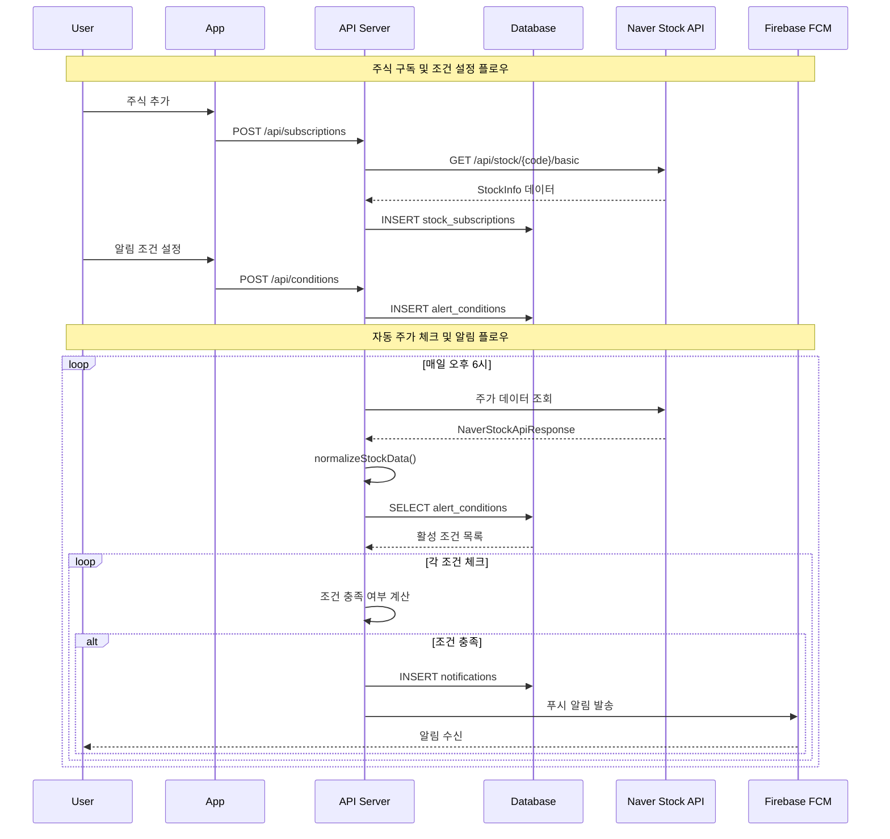
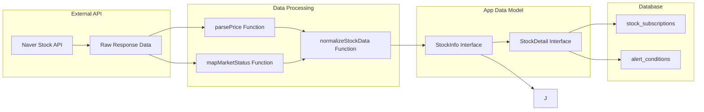
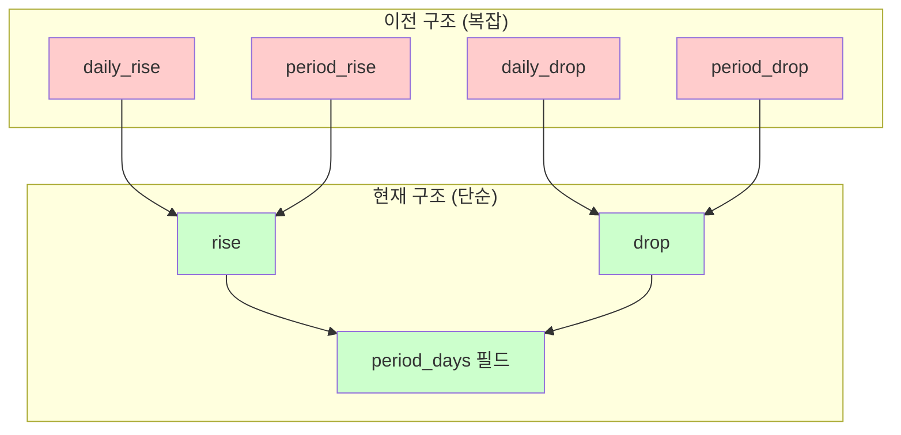
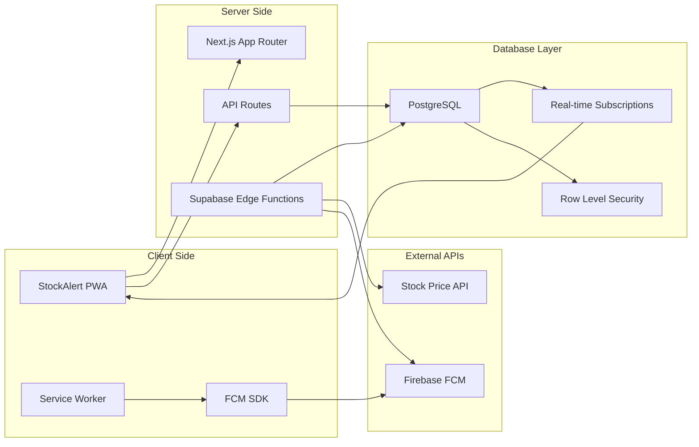
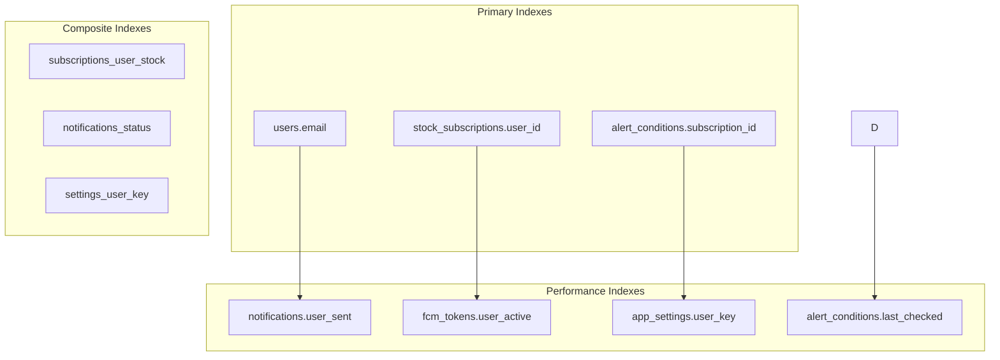
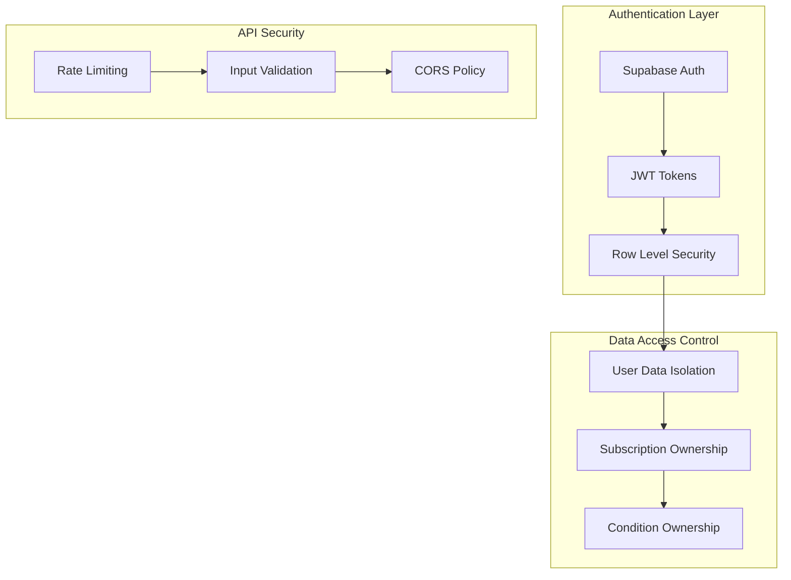
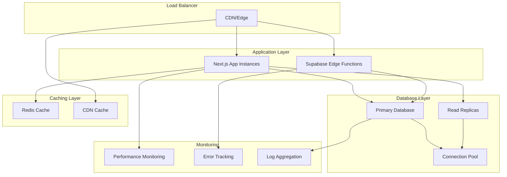

# StockAlert 데이터베이스 관계도

## 전체 시스템 아키텍처

## 데이터베이스 테이블 관계도

## API 연동 데이터 플로우

## 데이터 변환 플로우

## 조건 타입 단순화 다이어그램

## 시스템 컴포넌트 다이어그램

## 인덱스 전략 다이어그램

## 보안 및 접근 제어 다이어그램

## 확장성 아키텍처 다이어그램

