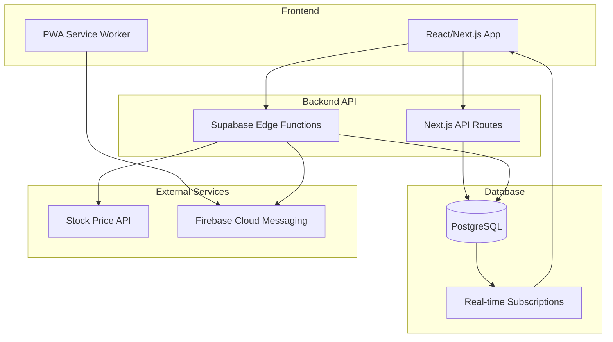
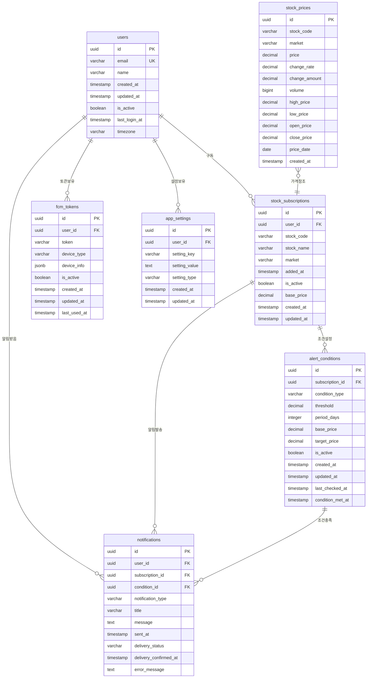
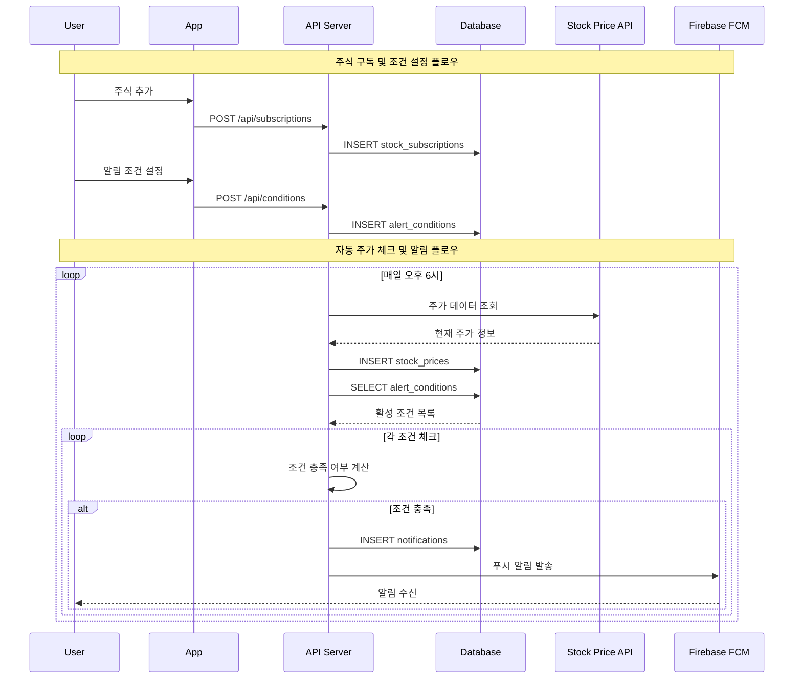
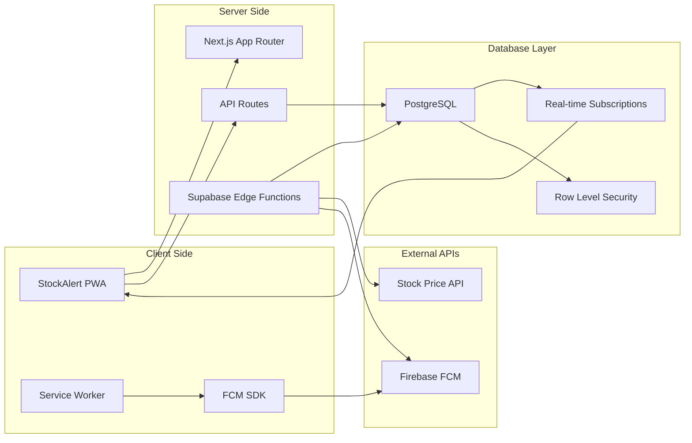
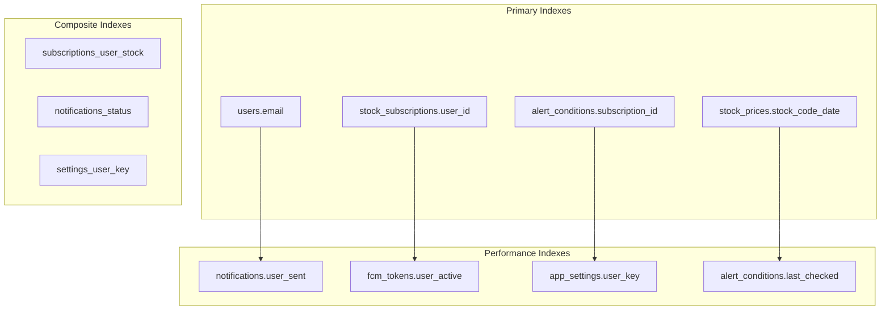
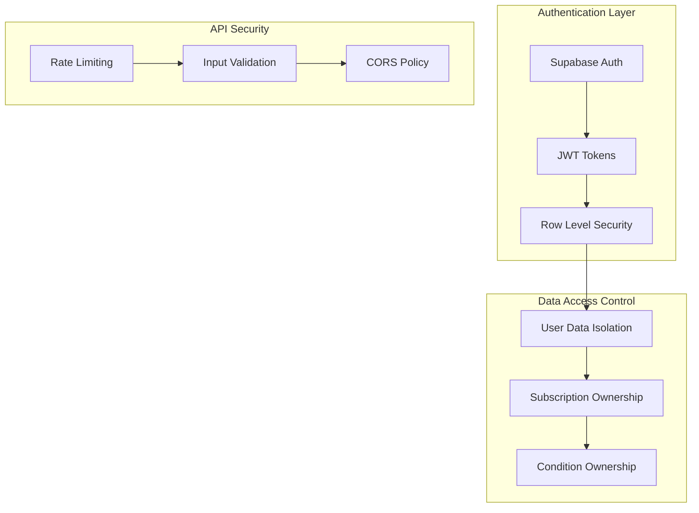
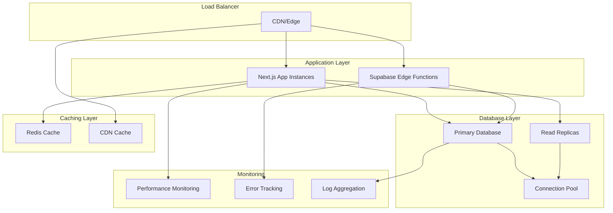

# StockAlert 데이터베이스 관계도

## 전체 시스템 아키텍처

```mermaid
graph TB
    subgraph "Frontend"
        A[React/Next.js App]
        B[PWA Service Worker]
    end
    
    subgraph "Backend API"
        C[Next.js API Routes]
        D[Supabase Edge Functions]
    end
    
    subgraph "Database"
        E[(PostgreSQL)]
        F[Real-time Subscriptions]
    end
    
    subgraph "External Services"
        G[Stock Price API]
        H[Firebase Cloud Messaging]
    end
    
    A --> C
    A --> D
    B --> H
    C --> E
    D --> E
    D --> G
    D --> H
    E --> F
    F --> A
```

## 데이터베이스 테이블 관계도

```mermaid
erDiagram
    users ||--o{ stock_subscriptions : "구독"
    users ||--o{ notifications : "알림받음"
    users ||--o{ fcm_tokens : "토큰보유"
    users ||--o{ app_settings : "설정보유"
    
    stock_subscriptions ||--o{ alert_conditions : "조건설정"
    stock_subscriptions ||--o{ notifications : "알림발송"
    
    alert_conditions ||--o{ notifications : "조건충족"
    
    stock_prices }o--|| stock_subscriptions : "가격참조"
    
    users {
        uuid id PK
        varchar email UK
        varchar name
        timestamp created_at
        timestamp updated_at
        boolean is_active
        timestamp last_login_at
        varchar timezone
    }
    
    stock_subscriptions {
        uuid id PK
        uuid user_id FK
        varchar stock_code
        varchar stock_name
        varchar market
        timestamp added_at
        boolean is_active
        decimal base_price
        timestamp created_at
        timestamp updated_at
    }
    
    alert_conditions {
        uuid id PK
        uuid subscription_id FK
        varchar condition_type
        decimal threshold
        integer period_days
        decimal base_price
        decimal target_price
        boolean is_active
        timestamp created_at
        timestamp updated_at
        timestamp last_checked_at
        timestamp condition_met_at
    }
    
    stock_prices {
        uuid id PK
        varchar stock_code
        varchar market
        decimal price
        decimal change_rate
        decimal change_amount
        bigint volume
        decimal high_price
        decimal low_price
        decimal open_price
        decimal close_price
        date price_date
        timestamp created_at
    }
    
    notifications {
        uuid id PK
        uuid user_id FK
        uuid subscription_id FK
        uuid condition_id FK
        varchar notification_type
        varchar title
        text message
        timestamp sent_at
        varchar delivery_status
        timestamp delivery_confirmed_at
        text error_message
    }
    
    fcm_tokens {
        uuid id PK
        uuid user_id FK
        varchar token
        varchar device_type
        jsonb device_info
        boolean is_active
        timestamp created_at
        timestamp updated_at
        timestamp last_used_at
    }
    
    app_settings {
        uuid id PK
        uuid user_id FK
        varchar setting_key
        text setting_value
        varchar setting_type
        timestamp created_at
        timestamp updated_at
    }
```

## 데이터 플로우 다이어그램

```mermaid
sequenceDiagram
    participant U as User
    participant A as App
    participant API as API Server
    participant DB as Database
    participant SP as Stock Price API
    participant FCM as Firebase FCM
    
    Note over U,FCM: 주식 구독 및 조건 설정 플로우
    
    U->>A: 주식 추가
    A->>API: POST /api/subscriptions
    API->>DB: INSERT stock_subscriptions
    
    U->>A: 알림 조건 설정
    A->>API: POST /api/conditions
    API->>DB: INSERT alert_conditions
    
    Note over U,FCM: 자동 주가 체크 및 알림 플로우
    
    loop 매일 오후 6시
        API->>SP: 주가 데이터 조회
        SP-->>API: 현재 주가 정보
        API->>DB: INSERT stock_prices
        
        API->>DB: SELECT alert_conditions
        DB-->>API: 활성 조건 목록
        
        loop 각 조건 체크
            API->>API: 조건 충족 여부 계산
            
            alt 조건 충족
                API->>DB: INSERT notifications
                API->>FCM: 푸시 알림 발송
                FCM-->>U: 알림 수신
            end
        end
    end
```

## 시스템 컴포넌트 다이어그램

```mermaid
graph LR
    subgraph "Client Side"
        A[StockAlert PWA]
        B[Service Worker]
        C[FCM SDK]
    end
    
    subgraph "Server Side"
        D[Next.js App Router]
        E[API Routes]
        F[Supabase Edge Functions]
    end
    
    subgraph "Database Layer"
        G[PostgreSQL]
        H[Real-time Subscriptions]
        I[Row Level Security]
    end
    
    subgraph "External APIs"
        J[Stock Price API]
        K[Firebase FCM]
    end
    
    A --> D
    A --> E
    B --> C
    C --> K
    E --> G
    F --> G
    F --> J
    F --> K
    G --> H
    H --> A
    G --> I
```

## 인덱스 전략 다이어그램

```mermaid
graph TD
    subgraph "Primary Indexes"
        A[users.email]
        B[stock_subscriptions.user_id]
        C[alert_conditions.subscription_id]
        D[stock_prices.stock_code_date]
    end
    
    subgraph "Performance Indexes"
        E[notifications.user_sent]
        F[fcm_tokens.user_active]
        G[app_settings.user_key]
        H[alert_conditions.last_checked]
    end
    
    subgraph "Composite Indexes"
        I[subscriptions_user_stock]
        J[notifications_status]
        K[settings_user_key]
    end
    
    A --> E
    B --> F
    C --> G
    D --> H
```

## 보안 및 접근 제어 다이어그램

```mermaid
graph TB
    subgraph "Authentication Layer"
        A[Supabase Auth]
        B[JWT Tokens]
        C[Row Level Security]
    end
    
    subgraph "Data Access Control"
        D[User Data Isolation]
        E[Subscription Ownership]
        F[Condition Ownership]
    end
    
    subgraph "API Security"
        G[Rate Limiting]
        H[Input Validation]
        I[CORS Policy]
    end
    
    A --> B
    B --> C
    C --> D
    D --> E
    E --> F
    G --> H
    H --> I
```

## 확장성 아키텍처 다이어그램

```mermaid
graph TB
    subgraph "Load Balancer"
        A[CDN/Edge]
    end
    
    subgraph "Application Layer"
        B[Next.js App Instances]
        C[Supabase Edge Functions]
    end
    
    subgraph "Database Layer"
        D[Primary Database]
        E[Read Replicas]
        F[Connection Pool]
    end
    
    subgraph "Caching Layer"
        G[Redis Cache]
        H[CDN Cache]
    end
    
    subgraph "Monitoring"
        I[Performance Monitoring]
        J[Error Tracking]
        K[Log Aggregation]
    end
    
    A --> B
    A --> C
    B --> D
    B --> E
    C --> D
    D --> F
    E --> F
    B --> G
    A --> H
    B --> I
    C --> J
    D --> K
```

