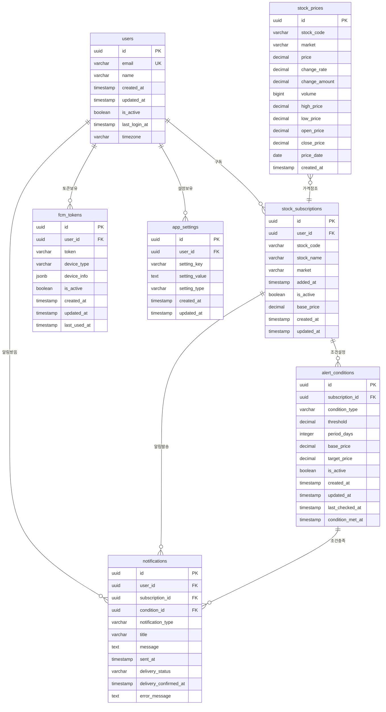

# StockAlert 데이터베이스 스키마 설계

## 개요
StockAlert 앱의 데이터베이스 스키마 설계 문서입니다. 주식 구독, 알림 조건, 사용자 관리 등의 핵심 기능을 지원하는 테이블 구조와 관계를 정의합니다.

## 테이블 목록
1. **users** - 사용자 정보
2. **stock_subscriptions** - 주식 구독 정보
3. **alert_conditions** - 알림 조건
4. **stock_prices** - 주가 데이터 (히스토리)
5. **notifications** - 알림 발송 기록
6. **fcm_tokens** - 푸시 알림 토큰 관리
7. **app_settings** - 앱 설정

---

## 1. users 테이블
사용자 기본 정보를 저장합니다.

```sql
CREATE TABLE users (
    id UUID PRIMARY KEY DEFAULT gen_random_uuid(),
    email VARCHAR(255) UNIQUE NOT NULL,
    name VARCHAR(100) NOT NULL,
    created_at TIMESTAMP WITH TIME ZONE DEFAULT NOW(),
    updated_at TIMESTAMP WITH TIME ZONE DEFAULT NOW(),
    is_active BOOLEAN DEFAULT TRUE,
    last_login_at TIMESTAMP WITH TIME ZONE,
    timezone VARCHAR(50) DEFAULT 'Asia/Seoul'
);
```

### 필드 설명
- `id`: 사용자 고유 식별자 (UUID)
- `email`: 이메일 주소 (로그인 ID)
- `name`: 사용자 이름
- `created_at`: 계정 생성일
- `updated_at`: 정보 수정일
- `is_active`: 계정 활성화 상태
- `last_login_at`: 마지막 로그인 시간
- `timezone`: 사용자 시간대

---

## 2. stock_subscriptions 테이블
사용자가 구독한 주식 정보를 저장합니다.

```sql
CREATE TABLE stock_subscriptions (
    id UUID PRIMARY KEY DEFAULT gen_random_uuid(),
    user_id UUID NOT NULL REFERENCES users(id) ON DELETE CASCADE,
    stock_code VARCHAR(10) NOT NULL,
    stock_name VARCHAR(100) NOT NULL,
    market VARCHAR(20) NOT NULL, -- 'KOSPI', 'KOSDAQ', 'NASDAQ', 'NYSE'
    added_at TIMESTAMP WITH TIME ZONE DEFAULT NOW(),
    is_active BOOLEAN DEFAULT TRUE,
    base_price DECIMAL(15,2), -- 구독 시점 기준 가격
    created_at TIMESTAMP WITH TIME ZONE DEFAULT NOW(),
    updated_at TIMESTAMP WITH TIME ZONE DEFAULT NOW(),
    
    UNIQUE(user_id, stock_code)
);
```

### 필드 설명
- `id`: 구독 고유 식별자
- `user_id`: 사용자 ID (외래키)
- `stock_code`: 주식 코드 (예: "005930")
- `stock_name`: 주식명 (예: "삼성전자")
- `market`: 시장 구분
- `added_at`: 구독 추가일
- `is_active`: 구독 활성화 상태
- `base_price`: 구독 시점 기준 가격

---

## 3. alert_conditions 테이블
알림 조건 설정을 저장합니다.

```sql
CREATE TABLE alert_conditions (
    id UUID PRIMARY KEY DEFAULT gen_random_uuid(),
    subscription_id UUID NOT NULL REFERENCES stock_subscriptions(id) ON DELETE CASCADE,
    condition_type VARCHAR(20) NOT NULL, -- 'daily_drop', 'daily_rise', 'period_drop', 'period_rise'
    threshold DECIMAL(5,2) NOT NULL, -- 등락률 (%)
    period_days INTEGER NOT NULL DEFAULT 1, -- 기간 (일)
    base_price DECIMAL(15,2) NOT NULL, -- 기준 가격
    target_price DECIMAL(15,2) NOT NULL, -- 목표 가격 (계산된 값)
    is_active BOOLEAN DEFAULT TRUE,
    created_at TIMESTAMP WITH TIME ZONE DEFAULT NOW(),
    updated_at TIMESTAMP WITH TIME ZONE DEFAULT NOW(),
    last_checked_at TIMESTAMP WITH TIME ZONE,
    condition_met_at TIMESTAMP WITH TIME ZONE, -- 조건 충족 시점
    
    CHECK (threshold > 0 AND threshold <= 100),
    CHECK (period_days > 0 AND period_days <= 30)
);
```

### 필드 설명
- `id`: 조건 고유 식별자
- `subscription_id`: 주식 구독 ID (외래키)
- `condition_type`: 조건 유형
- `threshold`: 등락률 임계값 (%)
- `period_days`: 조건 적용 기간 (일)
- `base_price`: 조건 설정 시점 기준 가격
- `target_price`: 계산된 목표 가격
- `is_active`: 조건 활성화 상태
- `last_checked_at`: 마지막 조건 체크 시간
- `condition_met_at`: 조건 충족 시점

---

## 4. stock_prices 테이블
주가 데이터 히스토리를 저장합니다.

```sql
CREATE TABLE stock_prices (
    id UUID PRIMARY KEY DEFAULT gen_random_uuid(),
    stock_code VARCHAR(10) NOT NULL,
    market VARCHAR(20) NOT NULL,
    price DECIMAL(15,2) NOT NULL,
    change_rate DECIMAL(8,4) NOT NULL, -- 변화율 (%)
    change_amount DECIMAL(15,2) NOT NULL, -- 변화량
    volume BIGINT NOT NULL DEFAULT 0, -- 거래량
    high_price DECIMAL(15,2), -- 고가
    low_price DECIMAL(15,2), -- 저가
    open_price DECIMAL(15,2), -- 시가
    close_price DECIMAL(15,2), -- 종가
    price_date DATE NOT NULL, -- 가격 기준일
    created_at TIMESTAMP WITH TIME ZONE DEFAULT NOW(),
    
    UNIQUE(stock_code, price_date)
);
```

### 필드 설명
- `id`: 가격 데이터 고유 식별자
- `stock_code`: 주식 코드
- `market`: 시장 구분
- `price`: 현재 가격
- `change_rate`: 변화율 (%)
- `change_amount`: 변화량
- `volume`: 거래량
- `high_price`, `low_price`, `open_price`, `close_price`: OHLC 데이터
- `price_date`: 가격 기준일

---

## 5. notifications 테이블
알림 발송 기록을 저장합니다.

```sql
CREATE TABLE notifications (
    id UUID PRIMARY KEY DEFAULT gen_random_uuid(),
    user_id UUID NOT NULL REFERENCES users(id) ON DELETE CASCADE,
    subscription_id UUID NOT NULL REFERENCES stock_subscriptions(id) ON DELETE CASCADE,
    condition_id UUID NOT NULL REFERENCES alert_conditions(id) ON DELETE CASCADE,
    notification_type VARCHAR(20) NOT NULL DEFAULT 'push', -- 'push', 'email', 'sms'
    title VARCHAR(200) NOT NULL,
    message TEXT NOT NULL,
    sent_at TIMESTAMP WITH TIME ZONE DEFAULT NOW(),
    delivery_status VARCHAR(20) DEFAULT 'pending', -- 'pending', 'sent', 'delivered', 'failed'
    delivery_confirmed_at TIMESTAMP WITH TIME ZONE,
    error_message TEXT,
    
    INDEX idx_user_sent_at (user_id, sent_at),
    INDEX idx_delivery_status (delivery_status)
);
```

### 필드 설명
- `id`: 알림 고유 식별자
- `user_id`: 사용자 ID
- `subscription_id`: 주식 구독 ID
- `condition_id`: 알림 조건 ID
- `notification_type`: 알림 유형
- `title`: 알림 제목
- `message`: 알림 메시지
- `sent_at`: 발송 시간
- `delivery_status`: 전달 상태
- `delivery_confirmed_at`: 전달 확인 시간
- `error_message`: 오류 메시지

---

## 6. fcm_tokens 테이블
Firebase Cloud Messaging 토큰을 관리합니다.

```sql
CREATE TABLE fcm_tokens (
    id UUID PRIMARY KEY DEFAULT gen_random_uuid(),
    user_id UUID NOT NULL REFERENCES users(id) ON DELETE CASCADE,
    token VARCHAR(500) NOT NULL,
    device_type VARCHAR(20) NOT NULL, -- 'web', 'android', 'ios'
    device_info JSONB, -- 디바이스 정보
    is_active BOOLEAN DEFAULT TRUE,
    created_at TIMESTAMP WITH TIME ZONE DEFAULT NOW(),
    updated_at TIMESTAMP WITH TIME ZONE DEFAULT NOW(),
    last_used_at TIMESTAMP WITH TIME ZONE DEFAULT NOW(),
    
    UNIQUE(user_id, token)
);
```

### 필드 설명
- `id`: 토큰 고유 식별자
- `user_id`: 사용자 ID
- `token`: FCM 토큰
- `device_type`: 디바이스 유형
- `device_info`: 디바이스 정보 (JSON)
- `is_active`: 토큰 활성화 상태
- `last_used_at`: 마지막 사용 시간

---

## 7. app_settings 테이블
앱 설정 정보를 저장합니다.

```sql
CREATE TABLE app_settings (
    id UUID PRIMARY KEY DEFAULT gen_random_uuid(),
    user_id UUID NOT NULL REFERENCES users(id) ON DELETE CASCADE,
    setting_key VARCHAR(50) NOT NULL,
    setting_value TEXT NOT NULL,
    setting_type VARCHAR(20) DEFAULT 'string', -- 'string', 'number', 'boolean', 'json'
    created_at TIMESTAMP WITH TIME ZONE DEFAULT NOW(),
    updated_at TIMESTAMP WITH TIME ZONE DEFAULT NOW(),
    
    UNIQUE(user_id, setting_key)
);
```

### 필드 설명
- `id`: 설정 고유 식별자
- `user_id`: 사용자 ID
- `setting_key`: 설정 키
- `setting_value`: 설정 값
- `setting_type`: 설정 값 타입

### 주요 설정 키
- `auto_check_time`: 자동 조회 시간 (기본값: 18)
- `notification_enabled`: 알림 활성화 여부
- `email_notifications`: 이메일 알림 여부
- `timezone`: 사용자 시간대

---

## 데이터베이스 관계도



---

## 인덱스 설계

### 성능 최적화를 위한 인덱스

```sql
-- 사용자 관련 인덱스
CREATE INDEX idx_users_email ON users(email);
CREATE INDEX idx_users_active ON users(is_active);

-- 주식 구독 관련 인덱스
CREATE INDEX idx_subscriptions_user_id ON stock_subscriptions(user_id);
CREATE INDEX idx_subscriptions_stock_code ON stock_subscriptions(stock_code);
CREATE INDEX idx_subscriptions_active ON stock_subscriptions(is_active);
CREATE INDEX idx_subscriptions_user_stock ON stock_subscriptions(user_id, stock_code);

-- 알림 조건 관련 인덱스
CREATE INDEX idx_conditions_subscription_id ON alert_conditions(subscription_id);
CREATE INDEX idx_conditions_active ON alert_conditions(is_active);
CREATE INDEX idx_conditions_last_checked ON alert_conditions(last_checked_at);
CREATE INDEX idx_conditions_met_at ON alert_conditions(condition_met_at);

-- 주가 데이터 관련 인덱스
CREATE INDEX idx_prices_stock_date ON stock_prices(stock_code, price_date);
CREATE INDEX idx_prices_date ON stock_prices(price_date);
CREATE INDEX idx_prices_market ON stock_prices(market);

-- 알림 관련 인덱스
CREATE INDEX idx_notifications_user_sent ON notifications(user_id, sent_at);
CREATE INDEX idx_notifications_status ON notifications(delivery_status);
CREATE INDEX idx_notifications_subscription ON notifications(subscription_id);

-- FCM 토큰 관련 인덱스
CREATE INDEX idx_fcm_tokens_user_id ON fcm_tokens(user_id);
CREATE INDEX idx_fcm_tokens_active ON fcm_tokens(is_active);
CREATE INDEX idx_fcm_tokens_last_used ON fcm_tokens(last_used_at);

-- 앱 설정 관련 인덱스
CREATE INDEX idx_settings_user_key ON app_settings(user_id, setting_key);
```

---

## 데이터베이스 제약조건

### 체크 제약조건
```sql
-- 알림 조건 임계값 제한
ALTER TABLE alert_conditions 
ADD CONSTRAINT chk_threshold_range 
CHECK (threshold > 0 AND threshold <= 100);

-- 기간 제한
ALTER TABLE alert_conditions 
ADD CONSTRAINT chk_period_range 
CHECK (period_days > 0 AND period_days <= 30);

-- 가격 양수 제한
ALTER TABLE stock_prices 
ADD CONSTRAINT chk_price_positive 
CHECK (price > 0);

-- 알림 타입 제한
ALTER TABLE notifications 
ADD CONSTRAINT chk_notification_type 
CHECK (notification_type IN ('push', 'email', 'sms'));

-- 전달 상태 제한
ALTER TABLE notifications 
ADD CONSTRAINT chk_delivery_status 
CHECK (delivery_status IN ('pending', 'sent', 'delivered', 'failed'));
```

---

## 샘플 데이터

### 사용자 데이터
```sql
INSERT INTO users (email, name, timezone) VALUES
('user1@example.com', '김철수', 'Asia/Seoul'),
('user2@example.com', '이영희', 'Asia/Seoul');
```

### 주식 구독 데이터
```sql
INSERT INTO stock_subscriptions (user_id, stock_code, stock_name, market, base_price) VALUES
((SELECT id FROM users WHERE email = 'user1@example.com'), '005930', '삼성전자', 'KOSPI', 75000),
((SELECT id FROM users WHERE email = 'user1@example.com'), '035420', '네이버', 'KOSPI', 200000);
```

### 알림 조건 데이터
```sql
INSERT INTO alert_conditions (subscription_id, condition_type, threshold, period_days, base_price, target_price) VALUES
((SELECT id FROM stock_subscriptions WHERE stock_code = '005930'), 'daily_drop', 4.0, 1, 75000, 72000),
((SELECT id FROM stock_subscriptions WHERE stock_code = '005930'), 'period_rise', 8.0, 3, 75000, 81000);
```

---

## 마이그레이션 전략

### 1단계: 기본 테이블 생성
1. users 테이블 생성
2. stock_subscriptions 테이블 생성
3. alert_conditions 테이블 생성

### 2단계: 확장 테이블 생성
1. stock_prices 테이블 생성
2. notifications 테이블 생성
3. fcm_tokens 테이블 생성
4. app_settings 테이블 생성

### 3단계: 인덱스 및 제약조건 추가
1. 성능 최적화 인덱스 생성
2. 데이터 무결성 제약조건 추가

### 4단계: 초기 데이터 설정
1. 기본 설정값 삽입
2. 테스트 데이터 생성

---

## 보안 고려사항

1. **데이터 암호화**: 민감한 정보는 암호화 저장
2. **접근 제어**: 사용자별 데이터 접근 권한 관리
3. **감사 로그**: 중요한 데이터 변경 이력 추적
4. **백업 전략**: 정기적인 데이터 백업 및 복구 계획

---

## 확장성 고려사항

1. **파티셔닝**: 대용량 데이터 처리를 위한 테이블 파티셔닝
2. **읽기 복제본**: 읽기 성능 향상을 위한 복제본 구성
3. **캐싱 전략**: 자주 조회되는 데이터의 캐싱
4. **모니터링**: 데이터베이스 성능 모니터링 및 알림

